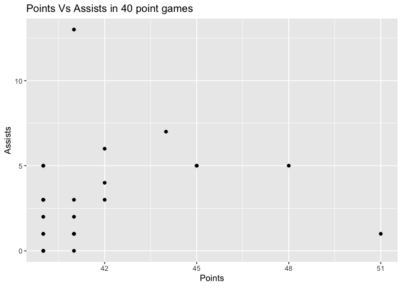

<!-- README.md is generated from README.Rmd. Please edit that file -->

# usportsR

<!-- badges: start -->
<!-- badges: end -->

`usportsR` is a package that is designed to provide users with data from
all Usports sanctioned sports.

- The package contains U Sports data spanning over a decade of
  pre-season, regular season, and post-season matches.

- Sports currently included are Soccer, Basketball, Ice Hockey, Field
  Hockey, Track and Field Field Hockey, Football, Wrestling, Swimming
  and Rugby

- We currently provide access to box score, play-by-play, schedules and
  rankings data

## Installation

You can install the development version of usportsR from
[GitHub](https://github.com/) with:

``` r
# install.packages("devtools")
devtools::install_github("uwaggs/usportsR")
```

## Example

This is a basic example which shows you how to solve a common problem:

``` r
library(usportsR)
library(dplyr)
#> 
#> Attaching package: 'dplyr'
#> The following objects are masked from 'package:stats':
#> 
#>     filter, lag
#> The following objects are masked from 'package:base':
#> 
#>     intersect, setdiff, setequal, union
## basic example to find number of 40+ point games in the last decade

mens_player_box_scores <- basketball_player_box_score("m",c(2023,2022,2021,2019,2018,2017,2016,2015,2014))
mens_40_pt_games <- mens_player_box_scores %>% filter(pts >= 40)
head(mens_40_pt_games,10)
#>                player min fgm fga three_pm three_pa ftm fta oreb dreb reb ast
#> 1  Brandon Meiklejohn  34  13  24       10       17   5   5    0    5   5   0
#> 2       Evan Shadkami  49  14  27        7       16   5   6    1    2   3   5
#> 3    Malcolm Christie  39  14  26        8       17  15  15    1    1   2   1
#> 4      Keivonte Watts  34  16  22        5        6   3   3    0    3   3   3
#> 5            Glen Cox  35  16  29        3        5  10  11    4    7  11   5
#> 6          Osman Omar  33  14  30        3        8  11  11    1    1   2   3
#> 7       Inaki Alvarez  33  14  22        6        8   6   8    1    2   3   1
#> 8        Diego Maffia  40  13  26        5       13  11  11    0    7   7   4
#> 9      Mason Bourcier  40  14  19        7       10   6   6    0   12  12  13
#> 10         Osman Omar  43  15  28        2       10   9  11    4    5   9   1
#>    stl blk to pf pts starter player_number
#> 1    0   0  2  1  41       1             6
#> 2    1   0  4  3  40       1            22
#> 3    1   0  2  1  51       1             6
#> 4    1   0  2  1  40       1             2
#> 5    4   0  5  2  45       1             5
#> 6    0   1  1  3  42       1             0
#> 7    1   0  4  2  40       1             3
#> 8    3   0  2  1  42       1             6
#> 9    2   0  6  4  41       1             1
#> 10   3   0  2  2  41       1             0
#>                                                             player_links
#> 1                                                                   <NA>
#> 2  https://en.usports.ca/sports/mbkb/2023-24/players?id=avs42wo2ohb400gg
#> 3  https://en.usports.ca/sports/mbkb/2023-24/players?id=5ki3q2xwba3i2d96
#> 4                                                                   <NA>
#> 5  https://en.usports.ca/sports/mbkb/2023-24/players?id=b67zrye7aju8w55n
#> 6  https://en.usports.ca/sports/mbkb/2022-23/players?id=29m15600sdtjhvjt
#> 7  https://en.usports.ca/sports/mbkb/2022-23/players?id=przhh6fbi5shcsec
#> 8                                                                   <NA>
#> 9                                                                   <NA>
#> 10 https://en.usports.ca/sports/mbkb/2021-22/players?id=rqbic84l8843aakc
#>                             date       game_id       team_name  season
#> 1   November 24, 2023  - 8:00 pm 20231124_77vc         Alberta 2023-24
#> 2  November 25, 2023  - 02:30 PM 20231125_wr2p            York 2023-24
#> 3   November 25, 2023  - 8:00 PM 20231125_ieb3       Dalhousie 2023-24
#> 4               December 2, 2023 20231202_1983     Mount Royal 2023-24
#> 5     January 6, 2024  - 6:00 PM 20240106_wfaw          Acadia 2023-24
#> 6   November 12, 2022  - 4:00 PM 20221112_v12q     Cape Breton 2022-23
#> 7    December 3, 2022  - 8:00 PM 20221203_1jzl         Toronto 2022-23
#> 8   February 11, 2023  - 7:00 pm 20230211_soqw        Victoria 2022-23
#> 9                  March 4, 2022 20220304_4m0h Trinity Western 2021-22
#> 10  November 28, 2021  - 3:00 PM 20211128_tbdr     Cape Breton 2021-22
#>    season_type
#> 1            r
#> 2            r
#> 3            r
#> 4            r
#> 5            r
#> 6            r
#> 7            r
#> 8            r
#> 9            p
#> 10           r
```

``` r
library(ggplot2)
## simple plot to illustrate points vs assists in 40+ point games in Usport basketball games

ggplot(mens_40_pt_games,aes(x = pts,y = ast)) + geom_point() +
  labs(title = "Points Vs Assists in 40 point games", x = "Points",y = "Assists")
```


