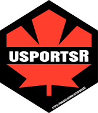

<!-- README.md is generated from README.Rmd. Please edit that file -->

# usportsR <a href="https://uwaggs.github.io/usportsR/"></a>

<!-- badges: start -->

[](https://cran.r-project.org/package=usportsR)
[](https://github.com/uwaggs/usportsR)
[](https://lifecycle.r-lib.org/articles/stages.html#stable)

[](https://github.com/uwaggs/usportsR/actions/workflows/R-CMD-check.yaml)
<!-- badges: end -->

`usportsR` is a package that is designed to provide users with data from
all Usports sanctioned sports.

- The package contains U Sports data spanning over a decade of
  pre-season, regular season, and post-season matches.

- Sports currently included are Soccer, Basketball, Ice Hockey, Field
  Hockey, Track and Field Field Hockey, Football, Wrestling, Swimming
  and Rugby

- We currently provide access to box score, play-by-play, schedules and
  rankings data

## Installation

You can install the CRAN version of
[**`usportsR`**](https://CRAN.R-project.org/package=usportsR) with:

``` r
install.packages("usportsR")
```

You can install the development version of usportsR from
[GitHub](https://github.com/) with:

``` r
# install.packages("devtools")
devtools::install_github("uwaggs/usportsR")
```

## Usage

Please refer to the package vignette for more information on how to use
this library. For those who prefer to program in Python,
[usportspy](https://github.com/uwaggs/usportspy/wiki) has complete
function parity with this package.

## Acknowledgement

A big thanks to [Rebecca Lai](https://www.rebeccalai.net) for the
awesome logo design!
